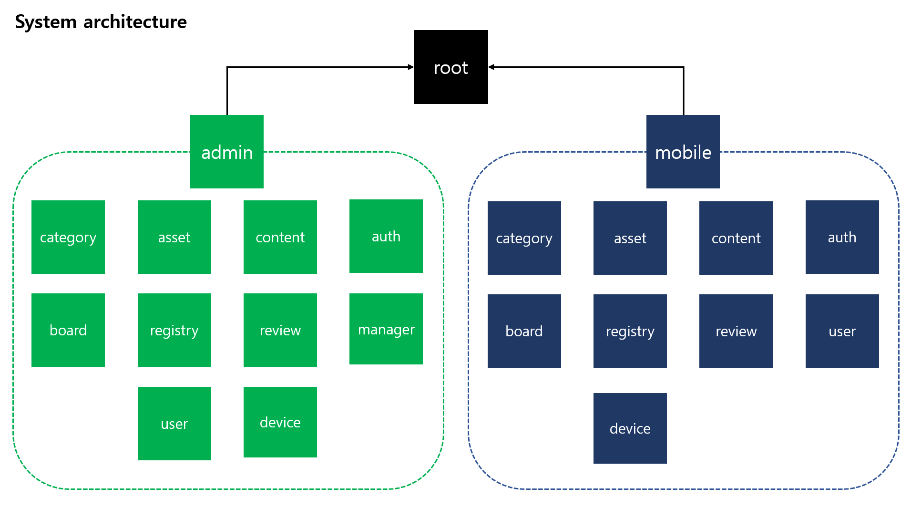
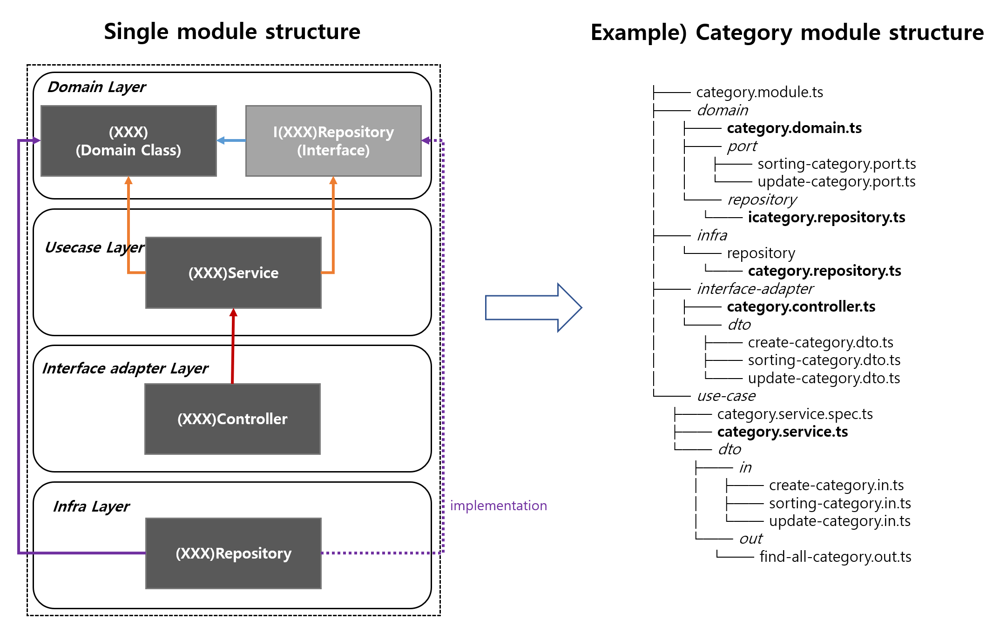
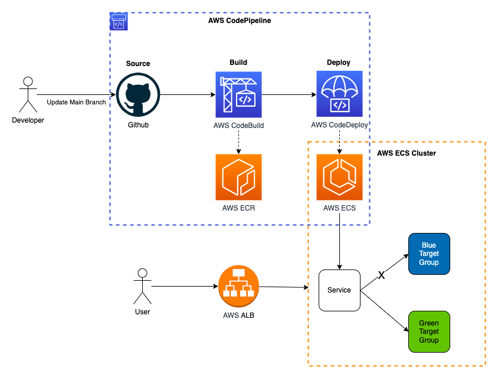
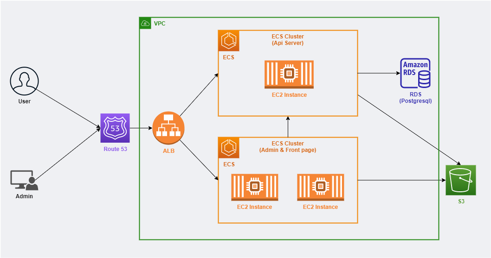

# Vroadway(v2) api server retrospect

### Purpose
- 기존 Vroadway의 서비스 기능 확장 및 유지 보수 절감을 위해 admin page와 api server migration

### API Server
- about legacy
  - 본래 2년 전까지 외주 업체에서 유지 보수 해왔으나 내부 사정으로 인해 직접 유지 보수하게 되었음
  - 처음부터 해당 도메인에 맞춰서 개발된 프로젝트가 아니었고, 다른 프로젝트에서 사용하던 코드를 일부만 변경한 상태의 프로젝트였기 때문에 사용하지 않는 코드에 대한 정리가 필요한 상황
  - 하나의 라우팅 함수에 비즈니스 로직과 DB 접근 로직까지 모두 들어있어 함수의 역할이 너무 방대하며 의미 파악이 힘들고 로직 분리, 재사용이 불가능 해 중복 로직이 다수 반복되어 있는 상태였으며 테스트 코드의 도입이 매우 힘든 형태
  - DB Entity의 잘못된 관계, 인덱스 설정들이 있었고 의미없이 저장하는 컬럼들이 존재
  - api 문서가 없었기 때문에 모바일 개발자들과 소통시 어려움
  - admin 용 api, mobile 용 api가 하나의 파일에 섞여 있는 형태였고, 어디서 쓰는 api 인지 확인하기 힘든
  형태로 개발

**기능에 대해 추가 요구 사항이 발생하던 중 위에 서술한 문제들에 의해 legacy 기반에서 추가 개발을 진행하는 것이 기술 부채를 더욱 늘린다고 판단하여 직접 회사에 migration을 제안하여 프로젝트 진행**

- why **Nest.js**?
  - Admin page 가 Angular(Typescript), Mobile Application 이 React Native(Typescript) 로 개발되어 있었고 소수 인원이 풀스택으로 개발하는 업무 형태였기 때문에 하나의 Language로 전체 스택을 개발할 수 있도록 Typescript(Node.js) 기반의 백엔드 프레임워크를 선택
  - Express가 아닌 NestJS를 선택한 이유는 자유도가 높을 수록 추후 아키텍처가 무너지기 쉽다고 판단했고,  프레임워크 차원에서 아키텍처에 대한 지원(DI, IoC 등)을 해줄 수 있는 프레임워크가 팀의 개발 환경에 더 적절하다고 생각했기 때문

- system architecture
  
  - 본래 admin에서 사용하는 api와 end-user용 api는 별개의 프로젝트로 분리하는 것이 더 일반적이지만 소수의 인원으로 운영해야 했고, 많은 트래픽이 발생하지 않았기 때문에 하나의 프로젝트에서 개발하되, 모듈을 분리하여 개발하도록 결정
  - 추후 팀이 커지거나 트래픽에 대한 문제가 발생할 시 분리하기 쉽도록 일부분 중복로직이 발생하더라도 최대한 분리하기 쉽도록 프로젝트 구성 
- single module

  - 개별 도메인 모듈의 컨텍스트 별로 구분된 clean architecture 기반의 시스템으로 test 코드 도입이 쉽도록 구성하였고, 개별 클래스의 역할을 명확하게 구분
  - **pros**
    - 테스트 코드 작성이 쉬움 
    - 코드의 경계가 명확하며, 요구사항 변경시 변경에 쉽게 대처할 수 있었음
  - **cons**
    - 레이어별로 DTO를 핸들링하기 귀찮음
    - 멀티 모듈간 transaction이 필요할 시 추가적인 라이브러리나 보일러플레이트 코드가 필요

### Infra (Devops)

- about legacy 
  - 레거시 프로젝트의 경우 CI/CD 파이프라인이 없는 형태로 개발자가 dockerized 된 이미지를 ECR에 push 한 뒤 ECS 작업을 생성하여 ECS 클러스터 서비스를 실행하던 상태 
  - Admin Page, API Server, Redis, Worker 이미지가 모두 하나의 task definition(ecs)으로 묶여서 하나의 ec2 instance에 모두 올라가 있던 상태 

- 개선

  - Github Action을 활용한 CI 파이프라인 구축 (린트, 빌드, 테스트 코드 성공 확인)
  - CodePipeline을 활용한 AWS ECS Blue/Green CD 파이프라인 구축
  - Admin Page, Account Page, API Server를 각각 다른 ECS 서비스로 운영해 각 서비스의 수정사항이 다른 서비스에 영향을 미치지 않도록 migration